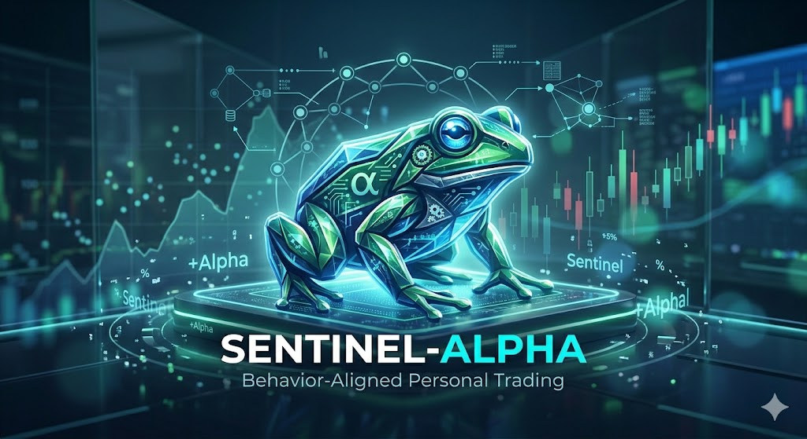

# Sentinel-Alpha



Behavior-Aligned Personal Trading Framework.

`Sentinel-Alpha` is a multi-agent trading research and product framework for building personal trading experts that adapt to an individual's behavior, intervention patterns, risk limits, and information environment.

The objective is not raw return maximization. The objective is user-aligned utility:

`U = E(R) - lambda * sigma^2 - phi(user_behavior)`

The current implementation supports multi-model routing rather than a single fixed LLM path. Different agents and tasks can use different providers and models, and strategy training can run as a guided auto-iteration loop or as a free iteration workflow.

Observability now includes:

- Prometheus metrics exposure
- Grafana dashboard entry configuration
- Sentry error reporting integration
- LangFuse tracing hooks for intelligence and strategy LLM tasks

The code mutation layer now includes a controlled `Programmer Agent` backed by `Aider`-style local editing flow:

- natural-language coding instruction intake
- constrained local file modification scope
- git diff capture
- commit hash capture
- rollback anchor capture
- strategy-code experiment history

## What Exists Now

- behavioral stress scenario generation
- behavioral profiling
- explicit trading-frequency and timeframe preference flow
- behavior-based recommendation of trading rhythm
- behavior-based recommendation of default strategy type
- unified strategy interface with multiple strategy families
- mandatory integrity and stress checks before strategy approval
- multi-model LLM configuration for agent routing and task routing
- generated strategy code artifacts stored in each strategy package
- iterative strategy training logs and loop state
- strategy report archive, version history, failure evolution, and version restore workflow
- profile evolution from feedback and trade records
- system health diagnostics with module status, agent logs, recent errors, and token usage
- library and SDK diagnostics inside system health
- controlled Programmer Agent for local strategy-code mutation and self-repair
- PostgreSQL / TimescaleDB / Qdrant / Redis persistence adapters
- dedicated frontend web module

## Main Docs

- technical guide: [github-technical-guide.md](/Users/harry/Documents/git/Sentinel-Alpha/docs/github-technical-guide.md)
- architecture: [architecture.md](/Users/harry/Documents/git/Sentinel-Alpha/docs/architecture.md)
- configuration: [configuration.md](/Users/harry/Documents/git/Sentinel-Alpha/docs/configuration.md)
- Docker deployment: [docker-deployment.md](/Users/harry/Documents/git/Sentinel-Alpha/docs/docker-deployment.md)
- API spec: [api-spec.md](/Users/harry/Documents/git/Sentinel-Alpha/docs/api-spec.md)
- database spec: [database-spec.md](/Users/harry/Documents/git/Sentinel-Alpha/docs/database-spec.md)
- workflow skill: [SKILL.md](/Users/harry/Documents/git/Sentinel-Alpha/skills/sentinel-alpha-workflow/SKILL.md)

## Run

Backend, in-memory:

```bash
cd /Users/harry/Documents/git/Sentinel-Alpha
PYTHONPATH=src uvicorn sentinel_alpha.api.app:app --host 127.0.0.1 --port 8001
```

Backend, persistent:

```bash
cd /Users/harry/Documents/git/Sentinel-Alpha
PYTHONPATH=src uvicorn sentinel_alpha.api.persistent_app:app --host 127.0.0.1 --port 8001
```

Frontend web module:

```bash
cd /Users/harry/Documents/git/Sentinel-Alpha
PYTHONPATH=src python -m sentinel_alpha.webapp.server
```

Dependency baseline:

- Python: `3.11+` locally, `python:3.13-slim` in Docker
- package constraints: [pyproject.toml](/Users/harry/Documents/git/Sentinel-Alpha/pyproject.toml)

Docker, memory mode:

```bash
cd /Users/harry/Documents/git/Sentinel-Alpha
docker compose --profile memory up --build
```

Docker, persistent mode:

```bash
cd /Users/harry/Documents/git/Sentinel-Alpha
docker compose --profile persistent up --build
```

Docker deployment details:

- [docker-deployment.md](/Users/harry/Documents/git/Sentinel-Alpha/docs/docker-deployment.md)

## License

This project is licensed under the Apache License 2.0.

- [LICENSE](/Users/harry/Documents/git/Sentinel-Alpha/LICENSE)

## Frontend

Canonical frontend module:

- [webapp](/Users/harry/Documents/git/Sentinel-Alpha/src/sentinel_alpha/webapp)
- [index.html](/Users/harry/Documents/git/Sentinel-Alpha/src/sentinel_alpha/webapp/static/index.html)
- [session.html](/Users/harry/Documents/git/Sentinel-Alpha/src/sentinel_alpha/webapp/static/pages/session.html)
- [simulation.html](/Users/harry/Documents/git/Sentinel-Alpha/src/sentinel_alpha/webapp/static/pages/simulation.html)
- [report.html](/Users/harry/Documents/git/Sentinel-Alpha/src/sentinel_alpha/webapp/static/pages/report.html)
- [preferences.html](/Users/harry/Documents/git/Sentinel-Alpha/src/sentinel_alpha/webapp/static/pages/preferences.html)
- [strategy.html](/Users/harry/Documents/git/Sentinel-Alpha/src/sentinel_alpha/webapp/static/pages/strategy.html)
- [intelligence.html](/Users/harry/Documents/git/Sentinel-Alpha/src/sentinel_alpha/webapp/static/pages/intelligence.html)
- [system-health.html](/Users/harry/Documents/git/Sentinel-Alpha/src/sentinel_alpha/webapp/static/pages/system-health.html)
- [operations.html](/Users/harry/Documents/git/Sentinel-Alpha/src/sentinel_alpha/webapp/static/pages/operations.html)

Frontend page rule:

- 首页只做产品总览和页面导航
- 会话创建、模拟测试、测试报告、交易偏好、策略训练、情报中心、系统健康、部署监控必须分页面承载
- 策略训练页必须支持循环迭代，而不是单次生成
- 策略训练页必须显示训练日志、检查失败原因、当前策略版本与模型路由信息

## LLM Routing

LLM selection is configuration-driven rather than hardcoded in business logic.

Current config supports:

- global LLM enablement
- default provider/model/temperature/max tokens
- per-agent routing
- per-task routing

Important task routes now include:

- `intent_translation`
- `noise_generation`
- `behavior_analysis`
- `market_summarization`
- `strategy_analysis`
- `strategy_codegen`
- `strategy_critic`
- `Programmer Agent`

Current programmer-agent support:

- controlled execution through local config
- target-path allowlist
- diff / commit / rollback outputs
- session-level archival through `programmer_runs`, `history_events`, and `report_history`

Current API support:

- `GET /api/llm-config`

Important runtime behavior:

- if provider credentials are present and LLM is enabled, the system can expose the live-model route
- if provider credentials are missing, the system falls back explicitly instead of pretending a live model ran

## Strategy Iteration

Strategy training is now modeled as a loop:

- submit or expand trade universe
- choose strategy type
- choose iteration mode:
  - `guided`
  - `free`
- choose auto-iteration count
- generate candidate
- generate strategy code artifact
- run integrity and stress/overfit checks
- if checks fail, keep iterating
- if checks pass, allow approval

Every iteration writes:

- strategy package
- strategy checks
- strategy training log
- feedback history
- strategy report archive
- version-comparison-ready metadata

The strategy frontend now exposes:

- current training status
- iteration history
- report archive
- version A vs version B comparison
- historical code viewer
- failure evolution timeline
- restore archived version into current experiment inputs
- Programmer Agent execution panel

## Validation

```bash
cd /Users/harry/Documents/git/Sentinel-Alpha
PYTHONPATH=src python -m pytest tests/test_api_workflow.py tests/test_strategy_interface.py tests/test_pipeline.py tests/test_scenario_generator.py
PYTHONDONTWRITEBYTECODE=1 python -m py_compile src/sentinel_alpha/**/*.py tests/*.py
node --check src/sentinel_alpha/webapp/static/script.js
node --check src/sentinel_alpha/webapp/static/session-shell.js
```
